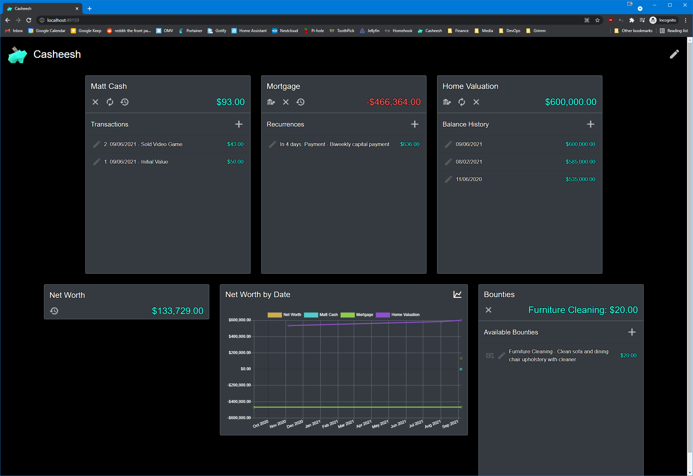

# Casheesh

Simple, self-hosted budgeting web app.

## Description

This application will provide a simple, mobile-friendly means to keep track of any number of cash accounts. It supports automatic-reccurring transactions, net worth, balance history, balance history chart and claimable bounties.

All configuration is done via the web app by clicking on the pencil icon in the top-right.



## Installation

You can self-host it on any server, as it is cross-platform, but I designed it with Docker in mind. See below for an example Docker configuration.

As an alternative, I've added a "Release" folder at root that contains the published website. You can use this to host the website directly on any server or system without the use of Docker. You can configure the contained "Casheesh.bat" file to modify the port or culture that Casheesh will use.

# Docker

If you wish to install Casheesh via docker, here are example configuration files.

The below file is the docker-compose file I use, including the port on which I host Casheesh as well as the culture locale Casheesh uses for currency format.

## docker-compose.yaml
```yaml
version: "3"

volumes:
  data:

services:
  casheesh:
    image: mattmckenzy/casheesh:latest
    container_name: casheesh
    environment:
      - PUID=985
      - PGID=982
      - TZ=America/Toronto
      - ASPNETCORE_URLS=http://+:8223
      - CULTURE=en-CA
    volumes:
      - data:/data
      - /etc/localtime:/etc/localtime:ro
      - /etc/timezone:/etc/timezone:ro
    restart: always
    
networks:
  default:
    external:
      name: home-net
```

The following file is my configuration for nginx. I serve Casheesh through it as a reverse proxy and use nginx to limit only local network connections to it. This is not necessary if you're not using a reverse proxy.

## casheesh.subdomain.conf (nginx reverse proxy configuration)
```nginx
server {
    listen 443 ssl;
    listen [::]:443 ssl;

    allow 192.168.1.0/24; # Only allow local network connections to the web app. Make sure to update to your network IP.
    deny all;

    server_name casheesh.*;

    include /config/nginx/ssl.conf;

    client_max_body_size 0;

    location / {

        include /config/nginx/proxy.conf;
        resolver 127.0.0.11 valid=30s;
        set $upstream_app casheesh;
        set $upstream_port 8223;
        set $upstream_proto http;
        proxy_pass $upstream_proto://$upstream_app:$upstream_port;

    }
}
```


# Donate

If you appreciate my work and feel like helping me realize other projects, you can donate at <a href="https://paypal.me/MattMckenzy">https://paypal.me/MattMckenzy</a>!